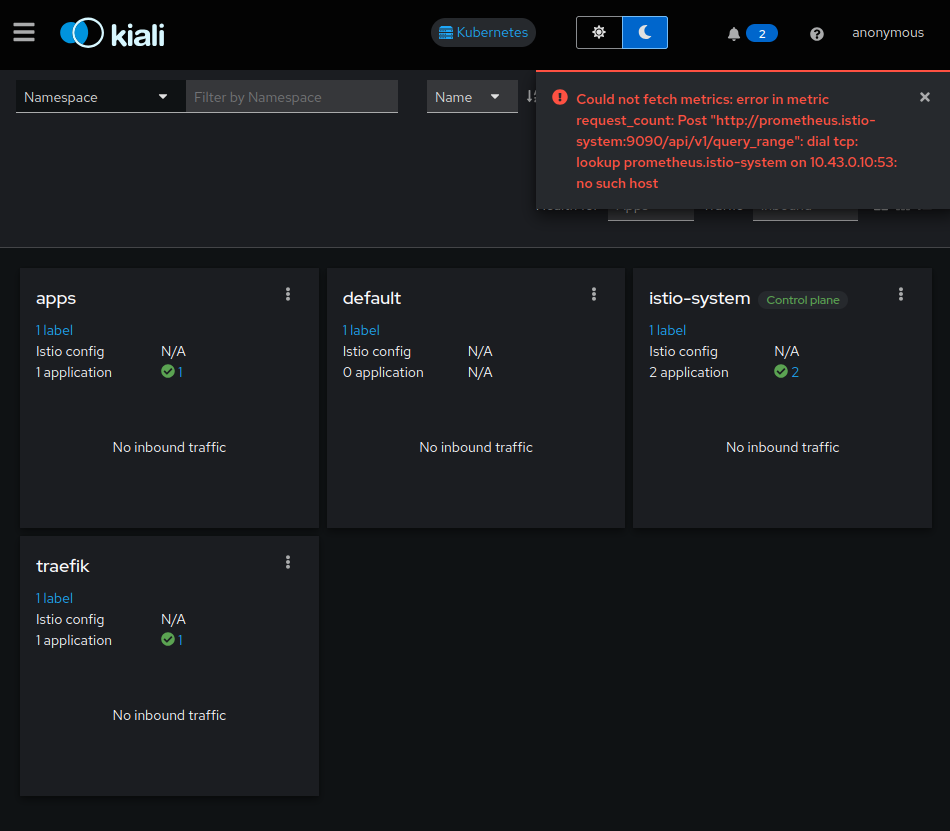
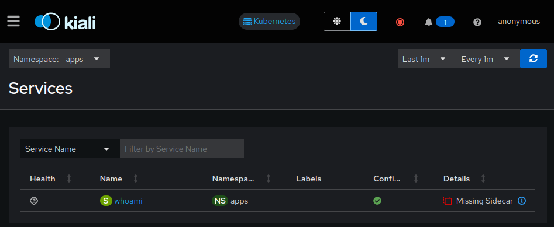
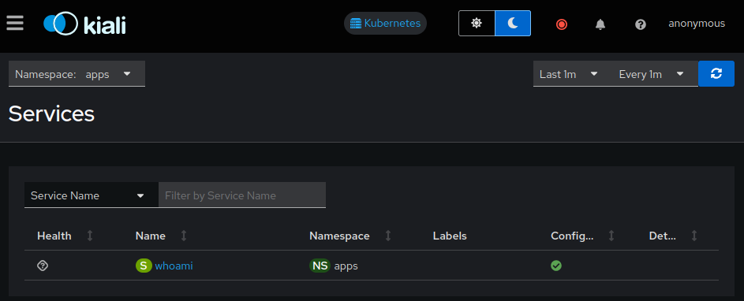

# Traefik + Istio

How to use Traefik Proxy on Kubernetes with Istio

## Pre-requisites

* [docker](https://docs.docker.com/install/)
* [k3d](https://k3d.io/stable/#installation)
* [kubectl](https://kubernetes.io/docs/tasks/tools/#kubectl)
* [helm](https://helm.sh/docs/intro/install/)
* [git](https://github.com/git-guides/install-git)

All config files are in the [public GitHub repository](https://github.com/traefik-tech-blog/traefik-istio) that accompany this article, so we just have to clone it:

```shell
git clone https://github.com/traefik-tech-blog/traefik-istio
cd traefik-istio
```

## Installation

For this tutorial, we will deploy Istio and Traefik Proxy on a k3d cluster in order to be able to test everything on a local machine.

```shell
k3d cluster create traefik --api-port 6550  --port 80:80@loadbalancer --port 443:443@loadbalancer --port 8000:8000@loadbalancer --k3s-arg "--disable=traefik@server:0"
```

```shell
INFO[0000] portmapping '443:443' targets the loadbalancer: defaulting to [servers:*:proxy agents:*:proxy] 
INFO[0000] portmapping '8000:8000' targets the loadbalancer: defaulting to [servers:*:proxy agents:*:proxy] 
INFO[0000] portmapping '80:80' targets the loadbalancer: defaulting to [servers:*:proxy agents:*:proxy] 
INFO[0000] Prep: Network                                
INFO[0000] Created network 'k3d-traefik'                
INFO[0000] Created image volume k3d-traefik-images      
INFO[0000] Starting new tools node...                   
INFO[0000] Starting node 'k3d-traefik-tools'            
INFO[0001] Creating node 'k3d-traefik-server-0'         
INFO[0001] Creating LoadBalancer 'k3d-traefik-serverlb' 
INFO[0001] Using the k3d-tools node to gather environment information 
INFO[0001] HostIP: using network gateway 172.18.0.1 address 
INFO[0001] Starting cluster 'traefik'                   
INFO[0001] Starting servers...                          
INFO[0001] Starting node 'k3d-traefik-server-0'         
INFO[0005] All agents already running.                  
INFO[0005] Starting helpers...                          
INFO[0005] Starting node 'k3d-traefik-serverlb'         
INFO[0012] Injecting records for hostAliases (incl. host.k3d.internal) and for 2 network members into CoreDNS configmap... 
INFO[0014] Cluster 'traefik' created successfully!      
INFO[0014] You can now use it like this:                
kubectl cluster-info
```

### Deploy Traefik

First, we will install Traefik Proxy with Helm:

```shell
# Add the Helm repository
helm repo add --force-update traefik https://traefik.github.io/charts
# Create a namespace
kubectl create namespace traefik
# Install the Helm chart
helm install traefik -n traefik --wait \
  --version v31.1.1 \
  --set ingressClass.enabled=false \
  --set ingressRoute.dashboard.enabled=true \
  --set ingressRoute.dashboard.matchRule='Host(`dashboard.docker.localhost`)' \
  --set ingressRoute.dashboard.entryPoints={web} \
  --set ports.web.nodePort=30000 \
  --set ports.websecure.nodePort=30001 \
  --set deployment.podLabels.app=traefik \
  --set deployment.podLabels.version=v3.1.4 \
   traefik/traefik
```

```shell
"traefik" has been added to your repositories
namespace/traefik created
NAME: traefik
LAST DEPLOYED: Wed Sep 25 15:33:05 2024
NAMESPACE: traefik
STATUS: deployed
REVISION: 1
TEST SUITE: None
NOTES:
traefik with docker.io/traefik:v3.1.4 has been deployed successfully on traefik namespace !
```

Once it's installed, we can access the local dashboard: http://dashboard.docker.localhost/

### Deploy Whoami

For this tutorial, we can use a go web application that display headers: [whoami](https://github.com/traefik/whoami) with this `IngressRoute`:

```yaml
apiVersion: traefik.io/v1alpha1
kind: IngressRoute
metadata:
  name: whoami
  namespace: apps
spec:
  entryPoints:
    - web
  routes:
  - match: Host(`whoami.docker.localhost`)
    kind: Rule
    services:
    - name: whoami
      port: 80
```

Let's deploy it:

```shell
kubectl create namespace apps
kubectl apply -n apps -f apps/whoami-deployment.yaml
kubectl apply -n apps -f apps/whoami-service.yaml
kubectl apply -n apps -f apps/whoami-ingressroute.yaml
kubectl wait -n apps --for=condition=ready pod --selector=app=whoami
```

```shell
namespace/apps created
deployment.apps/whoami created
service/whoami created
ingressroute.traefik.io/whoami created
pod/whoami-84cb9b6466-zbcr4 condition met
```

It should be accessible with curl on http://whoami.docker.localhost

```shell
curl whoami.docker.localhost
```

```shell
Hostname: whoami-84cb9b6466-zbcr4
IP: 127.0.0.1
IP: ::1
IP: 10.42.0.7
IP: fe80::6465:98ff:fe9b:7efa
RemoteAddr: 10.42.0.6:40966
GET / HTTP/1.1
Host: whoami.docker.localhost
User-Agent: curl/7.88.1
Accept: */*
Accept-Encoding: gzip
X-Forwarded-For: 10.42.0.1
X-Forwarded-Host: whoami.docker.localhost
X-Forwarded-Port: 80
X-Forwarded-Proto: http
X-Forwarded-Server: traefik-55c585bb7d-b9dr9
X-Real-Ip: 10.42.0.1
```

### Deploy Istio and Kiali

We will also use Helm to install Istio, following their [documentation](https://istio.io/latest/docs/setup/platform-setup/k3d).

```shell
# Add Istio Helm repository
helm repo add --force-update istio https://istio-release.storage.googleapis.com/charts
# Create the namespace
kubectl create namespace istio-system
# Deploy validating web hook used by Istio
helm install istio-base istio/base -n istio-system --wait
# Deploy Istio
helm install istiod istio/istiod -n istio-system --wait
```

```shell
"istio" has been added to your repositories
namespace/istio-system created
NAME: istio-base
LAST DEPLOYED: Wed Sep 25 15:37:32 2024
NAMESPACE: istio-system
STATUS: deployed
REVISION: 1
TEST SUITE: None
NOTES:
Istio base successfully installed!

To learn more about the release, try:
  $ helm status istio-base -n istio-system
  $ helm get all istio-base -n istio-system
NAME: istiod
LAST DEPLOYED: Wed Sep 25 15:37:33 2024
NAMESPACE: istio-system
STATUS: deployed
REVISION: 1
TEST SUITE: None
NOTES:
"istiod" successfully installed!

To learn more about the release, try:
  $ helm status istiod -n istio-system
  $ helm get all istiod -n istio-system

Next steps:
  * Deploy a Gateway: https://istio.io/latest/docs/setup/additional-setup/gateway/
  * Try out our tasks to get started on common configurations:
    * https://istio.io/latest/docs/tasks/traffic-management
    * https://istio.io/latest/docs/tasks/security/
    * https://istio.io/latest/docs/tasks/policy-enforcement/
  * Review the list of actively supported releases, CVE publications and our hardening guide:
    * https://istio.io/latest/docs/releases/supported-releases/
    * https://istio.io/latest/news/security/
    * https://istio.io/latest/docs/ops/best-practices/security/

For further documentation see https://istio.io website
```

Istio comes with an observability console named [kiali](https://istio.io/latest/docs/ops/integrations/kiali/).

The simplest way to install it is with yaml. We will expose this dashboard using this `IngressRoute`:

```yaml
apiVersion: traefik.io/v1alpha1
kind: IngressRoute
metadata:
  name: kiali
  namespace: istio-system
spec:
  entryPoints:
    - web
  routes:
  - match: Host(`kiali.docker.localhost`)
    kind: Rule
    services:
    - name: kiali
      port: http
```

Let's deploy it:

```shell
kubectl apply -f kiali.yaml
kubectl apply -f kiali-ingressroute.yaml
kubectl wait -n istio-system --for=condition=ready pod --selector=app=kiali --timeout=90s
```

```shell
serviceaccount/kiali created
configmap/kiali created
clusterrole.rbac.authorization.k8s.io/kiali created
clusterrolebinding.rbac.authorization.k8s.io/kiali created
role.rbac.authorization.k8s.io/kiali-controlplane created
rolebinding.rbac.authorization.k8s.io/kiali-controlplane created
service/kiali created
deployment.apps/kiali created
ingressroute.traefik.io/kiali created
pod/kiali-5df8897db6-bnccl condition met
```

Then we should be able to access to kiali dashboard: http://kiali.docker.localhost



The error message about prometheus is harm-less and expected : we have not configured metrics.

## Permissive mode

By default, Istio is _permissive_.

Istio [documentation](https://istio.io/latest/docs/tasks/security/authentication/mtls-migration/) precise what it means:
> When PERMISSIVE mode is enabled, a service can accept both plaintext and mutual TLS traffic. In order to only allow mutual TLS traffic, the configuration needs to be changed to STRICT mode.

In kiali, we can see istio is not yet fully deployed: sidecar is missing on whoami app:

http://kiali.docker.localhost/kiali/console/services?duration=60&refresh=60000&namespaces=apps




The sidecar can be added automatically using [sidecar injection](https://istio.io/latest/docs/setup/additional-setup/sidecar-injection).

Let's try it:

```shell
kubectl label namespace apps istio-injection=enabled --overwrite
kubectl label namespace traefik istio-injection=enabled --overwrite
```

We can check namespace injection status with this command:

```shell
kubectl get namespace -L istio-injection
```

```shell
NAME              STATUS   AGE     ISTIO-INJECTION
kube-system       Active   4h13m   
kube-public       Active   4h13m   
kube-node-lease   Active   4h13m   
default           Active   4h13m   
istio-system      Active   4h12m   
apps              Active   3h50m   enabled
traefik           Active   4h1m    enabled
```

The sidecar is created on restart, so let's restart both Traefik and Whoami:

```shell
kubectl rollout restart -n apps deployment/whoami
kubectl rollout restart -n traefik deployment/traefik
sleep 5
```

We can see that there is now two containers on those pods with kubectl

```shell
kubectl get pods -l 'app in (whoami, traefik)' -A
```

```shell
NAMESPACE   NAME                       READY   STATUS    RESTARTS   AGE
traefik     traefik-6b5f7d4976-cqrq2   2/2     Running   0          4m
apps        whoami-85cdf9b47b-z5xvm    2/2     Running   0          3m
```

and also on Kiali:



Since the sidecar of istio contains tcpdump, we can check the traffic with those commands:

```shell
# On Traefik
kubectl exec -n traefik $(kubectl get pod -n traefik  -l app=traefik  -o jsonpath='{.items..metadata.name}') -c istio-proxy -- sudo tcpdump dst port 80  -A
# On Whoami
kubectl exec -n apps $(kubectl get pod -n apps -l app=whoami -o jsonpath='{.items..metadata.name}') -c istio-proxy -- sudo tcpdump dst port 80  -A
```

It will fail, since we didn't allow priviliged operation on the sidecar.

```shell
sudo: The "no new privileges" flag is set, which prevents sudo from running as root.
sudo: If sudo is running in a container, you may need to adjust the container configuration to disable the flag.
command terminated with exit code 1
```

We can upgrade istio installation to allow us to see the traffic with this command:

```shell
helm upgrade istiod -n istio-system --wait \
  --set global.proxy.privileged=true \
   istio/istiod
```

We need to rollout the pods in order to re-create the sidecar with this new option:

```shell
kubectl rollout restart -n apps deployment/whoami
kubectl rollout restart -n traefik deployment/traefik
sleep 5
```

Then the tcpdump will show you the data that pass through the proxy each time a curl is done on whoami:

```shell
curl whoami.docker.localhost
```

We can see that it's passing through the sidecar **and** it's not (yet) ciphered. We'll see how to configure it on the next section.

## Strict mode

Istio allows to enforce that mTLS is used between pods.

It can be configured on a namespace level by applying this custom resource:

```yaml
apiVersion: security.istio.io/v1
kind: PeerAuthentication
metadata:
  name: default
spec:
  mtls:
    mode: STRICT
```

We can apply it on both `traefik` and `apps` namespace:

```shell
kubectl apply -n apps -f mtls-strict.yaml
kubectl apply -n traefik -f mtls-strict.yaml
```

We can confirm with `curl` that now mTLS is mandatory:

```shell
curl  whoami.docker.localhost
```

```shell
curl: (52) Empty reply from server
```

It's failing because there are [pre-requisites](https://istio.io/latest/docs/ops/integrations/loadbalancers/#in-cluster-load-balancers) when using an (external) Reverse Proxy with Istio:

1. Disable inbound traffic redirection
   - That can be set with the empty annotation [traffic.sidecar.istio.io/includeInboundPorts](https://istio.io/latest/docs/reference/config/annotations/#SidecarTrafficIncludeInboundPorts)
2. Enable routing on `Service`
   - That can be configured on Traefik Proxy on the Kubernetes provider level with `nativeLBByDefault`
3. Setting the `Host` header to the service internal fqdn

Let's upgrade our setup with those settings:

```shell
helm upgrade traefik -n traefik --wait \
  --version v31.1.1 \
  --reuse-values \
  --set providers.kubernetesCRD.nativeLBByDefault=true \
  --set providers.kubernetesIngress.nativeLBByDefault=true \
  --set 'deployment.podAnnotations.traffic\.sidecar\.istio\.io/includeInboundPorts=''''' \
   traefik/traefik
```

And let's add this `Host` header on `whoami`:

```diff
--- apps/whoami-ingressroute.yaml
+++ apps/whoami-ingressroute-istio.yaml
@@ -9,6 +9,17 @@
   routes:
   - match: Host(`whoami.docker.localhost`)
     kind: Rule
+    middlewares:
+    - name: whoami-istio
     services:
     - name: whoami
       port: 80
+---
+apiVersion: traefik.io/v1alpha1
+kind: Middleware
+metadata:
+  name: whoami-istio
+  namespace: apps
+spec:
+  headers:
+    customRequestHeaders:
+      Host: whoami.apps.svc
```

Let's apply it:

```shell
kubectl apply -f apps/whoami-ingressroute-istio.yaml
```

Et voilà ! Access to whoami is back, with mTLS:

```shell
curl whoami.docker.localhost
```

We can see in header `X-Forwarded-Client-Cert` some information about the cert used with mTLS

```shell
Hostname: whoami-85cdf9b47b-z5xvm
IP: 127.0.0.1
IP: ::1
IP: 10.42.0.36
IP: fe80::7890:fff:fe00:548f
RemoteAddr: 127.0.0.6:38857
GET / HTTP/1.1
Host: whoami.apps.svc
User-Agent: curl/7.88.1
Accept: */*
Accept-Encoding: gzip
X-Envoy-Attempt-Count: 1
X-Envoy-Internal: true
X-Forwarded-Client-Cert: By=spiffe://cluster.local/ns/apps/sa/default;Hash=2f6c8f985d25ee5496b4747dec67ef5bb36940c02aca24a7cca95aa0860791cf;Subject="";URI=spiffe://cluster.local/ns/traefik/sa/traefik
X-Forwarded-For: 10.42.0.1
X-Forwarded-Host: whoami.docker.localhost
X-Forwarded-Port: 80
X-Forwarded-Proto: http
X-Forwarded-Server: traefik-6b5f7d4976-cqrq2
X-Real-Ip: 10.42.0.1
X-Request-Id: f12c43b7-e637-4c49-a3fd-c927561070d2
```

We can confirm with tcpdump commands on both sides that now the traffic is ciphered on both ends:

```shell
# on Traefik Proxy
kubectl exec -n traefik $(kubectl get pod -n traefik  -l app=traefik  -o jsonpath='{.items..metadata.name}') -c istio-proxy -- sudo tcpdump dst port 80  -A
# on Whoami
kubectl exec -n apps $(kubectl get pod -n apps -l app=whoami -o jsonpath='{.items..metadata.name}') -c istio-proxy -- sudo tcpdump dst port 80  -A
```

## Cleanup

The cluster can be deleted with k3d:

```shell
k3d cluster delete traefik
```
